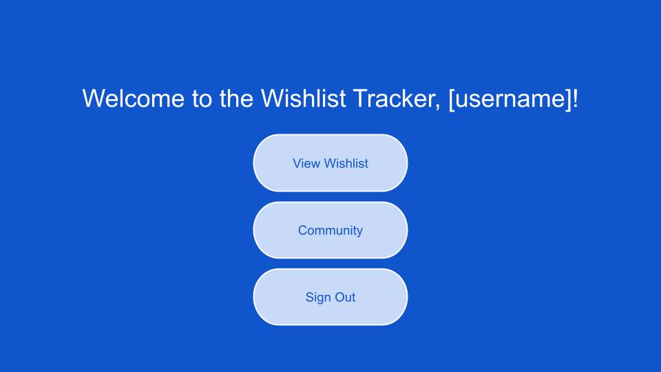

# Wishlist Tracker
My project will allow a user to create a wishlist and be able to edit, delete and access it when they are logged in. The items in the wishlist will contain information such as the item name, price, description and a link for where to buy it. A user will also be able to see other users wishlists and vice versa through a community page.

## User Stories / MVP
- As a user (AAU), I want to be able to create a profile and sign in so that I can access my wishlist.
- AAU, I want to easily be able to access the different pages and functions of the website depending on when I'm logged in or logged out (i.e. log in, sign in, log out, view wishlist, etc...).
- AAU, I want to be able to add, update and delete items in my wishlist and for those changes to be saved automatically.
- AAU, I want my items to have information such as the name, price, description and link of item sold on another website.
- AAU, I want to see other users' wishlists without being able to edit them. I also want them to be able to see my wishlist without editing it. 
- AAU, I want to be able to click on items in my wishlist to see more details about them.

## Wire Frames

## ERD

## Routes
| Action | Route | HTTP Verb |
| ------ | ----- | --------- |
| Index | 'users/:userId/wishlist' | GET
| New |'users/:userId/wishlist/new' | GET
| Create | 'users/:userId/wishlist' | POST
| Show | 'users/:userId/wishlist/:itemId' | GET
| Edit | 'users/:userId/wishlist/:itemId/edit' | GET
| Update | 'users/:userId/wishlist/:itemId' | PUT
| Delete | 'users/:userId/wishlist/:itemId' | DELETE

## Stretch Goals
- Each item has a check box, so that when a user acquires something from their wislist, they can click it to show that it has been acquired.
- Items are not shown as a list of names but preferably a gallery with a picture of the item. If no picture is provided, there will be a default picture used.
- A user can make folders to organize their wishlist.
- There can be private folders or items that are only visible to the user and don't show up when other users look at their profile.
- Have different ways to filter or change order of wishlist.