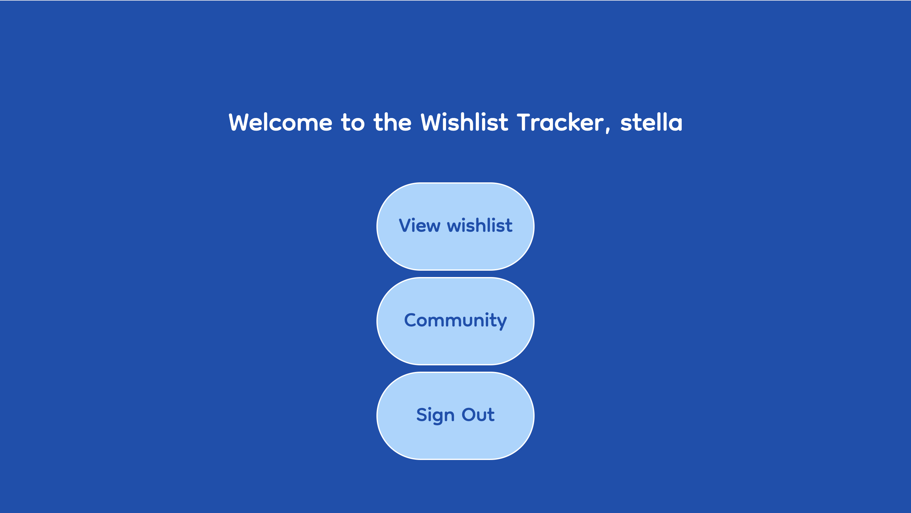

# The Wishlist Tracker
The Wishlist Tracker is a tool that helps users keep track of their wishlists while also allowing them to view their friends' wishlists. Users can add, edit, and manage their wishlist items, including details such as price, item link, and additional notes.

You can sign up and start tracking your wishlist [here](https://wishlist-tracking-production.up.railway.app/).

## Features
- **Create & Edit Wishlists** – Add items with details like price and links.
- **View Friends’ Wishlists** – Browse wishlists of other users.
- **Secure User Accounts** – Sign up and manage wishlists privately.

## Technologies Used
- **JavaScript:** Logic and interactivity
- **EJS:** Structure and layout
- **CSS:** Styling
- **ChatGPT:** Writing README

### Modules:
- **Node.js & Express** – Server-side logic
- **MongoDB & Mongoose** – Data storage
- **bcrypt** – Secure password hashing
- **express-session & connect-mongo** – Session handling
- **method-override** – Enables PUT & DELETE requests
- **dotenv** – Environment variable management
- **morgan** – Request logging

## Next Steps
- **Mark Items as Acquired** – Users can check off wishlist items when they get them.
- **Gallery View** – Display wishlist items with images instead of just names. If no image is provided, a default placeholder will be used.
- **Wishlist Organization** – Users can create folders to categorize their items.
- **Privacy Settings** – Users can make certain items or folders private, so they don’t appear on public wishlists.
- **Sorting & Filtering** – Allow users to sort wishlists by price, category, or recently added items.